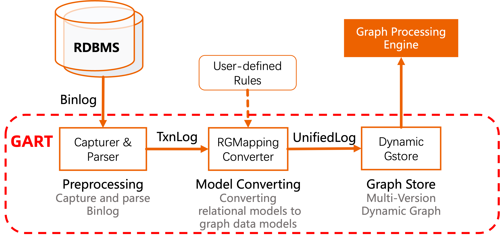
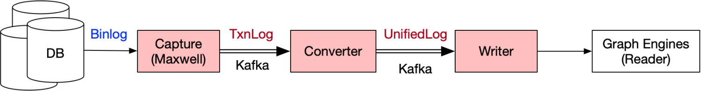

# GART: Graph Analysis on Relational Transactional Datasets

GART is a graph extension that includes an interface to an RDBMS and a dynamic graph store for online graph processing.

## Table of Contents
- [What is GART](#what-is-gart)
- [Features](#features)
    - [Transparent Data Model Conversion](#transparent-data-model-conversion)
    - [Efficient Dynamic Graph Storage](#efficient-dynamic-graph-storage)
- [Deployment](#deployment)
    - [Requirements](#requirements)
    - [Building](#building)
- [Getting Started](#getting-started)
    - [Configure Data Source](#configure-data-source)
    - [Configure Capture](#configure-capture)
    - [Run GART](#run-gart)
    - [Mirco Demo: Graph Analysis on Data from MySQL](#mirco-demo-graph-analysis-on-data-from-mysql)
- [License](#license)
- [Publications](#publications)

## What is GART

Hybrid transactional/analytical processing (HTAP) is a new trend that processes OLTP and online analytical processing (OLAP) in the same system simultaneously.
Analogously, we term dynamic graph analysis processing workloads on transactional datasets as hybrid transactional/graph-analytical processing (**HTGAP**).
GART reuses transaction logs to replay graph data online for freshness instead of offline data migration for freshness and performance.

GART captures the data changes in different (relational) data sources (e.g., database systems, streaming systems) and converts them to graph data according to user-defined rules.

In detail, the workflow of GART can be broken into the following steps:



- **1. Preprocess (Capture & Parser)**:
GART captures data changes from data sources by logs (e.g., Binlogs in SQL systems). Then, it parsers these logs into a recognized format, called as TxnLog. Currently, we use [Debezium](https://debezium.io/) (for MySQL, PostgreSQL, ...) or [Maxwell](https://github.com/zendesk/maxwell) (only for MySQL) as the log capture.

    The sample format of an inserted tuple of TxnLog is as follows (Debezium style, only necessary information):
  ```
  {
    "before": null,
    "after": {
        "org_id": "0",
        "org_type": "company",
        "org_name": "Kam_Air",
        "org_url": "http://dbpedia.org/resource/Kam_Air"
    },
    "source": {
        "ts_ms": 1689159703811,
        "db": "ldbc",
        "table": "organisation"
    },
    "op": "c"
  }
  ```
  This sample records the log that inserts a tuple of `organisation`.

- **2. Model Convert (RGMapping Converter)**:
This step is an important step for GART. The conversion between different data models for HTGAP workloads requires more semantic information.
For example, it needs the mapping between relational tables and vertex/edge types, and the mapping between relational attributes and vertex/edge properties.
The GART administrator (such as DBA) can define the rules of relation-graph mapping (RGMapping) once by the interfaces provided by GART.
GART will convert relational data changes into graph data changes in the *unified logs* (UnifiedLog) automatically.

- **3. Graph Store (Dynamic GStore)**:
GART applies the graph data changes on the graph store. The graph store is dynamic, which means the writes from GART and the reads from the graph analysis processing can be executed on the store concurrently.

## Features

Compared to current solutions that provide graph interfaces on relational data, GART has three main features:

### Transparent Data Model Conversion
To adapt to rich workload flexibility, GART proposes transparent data model conversion by graph extraction interfaces, which define rules of relational-graph mapping.

We provide a sample definition file called [rgmapping-ldbc.yaml](vegito/test/schema/rgmapping-ldbc.yaml).

### Efficient Dynamic Graph Storage
To ensure the performance of graph analytical processing (GAP), GART proposes an efficient dynamic graph storage with good locality that stems from key insights into HTGAP workloads, including:
1. an efficient and mutable compressed sparse row (CSR) representation to guarantee the locality of scanning edges;
2. a coarse-grained MVCC to reduce the temporal and spatial overhead of versioning;
3. a flexible property storage to efficiently run various GAP workloads.

Please refer to [our paper](https://www.usenix.org/conference/atc23/presentation/shen) for specific technical implementation details.

### Service-Oriented Deployment Model
GART acts as a service to synchronize database changes to the graph store.
When pulled up as a service on its own, users can try out the full power of GART and different graph computation engines on the graph store.
At the same time, GART also provides a front-end, used as a database plug-in, currently supported as PostgreSQL extension.
Users can invoke GART's functions in the database client, such as RGMapping definitions, graph computation on the graph store, etc.

## Deployment

### Requirements

- [glog](https://github.com/google/glog), [gflags](https://github.com/gflags/gflags)
- [etcd-cpp-apiv3](https://github.com/etcd-cpp-apiv3/etcd-cpp-apiv3)
- [TBB](https://github.com/oneapi-src/oneTBB)
- [librdkafka](https://github.com/confluentinc/librdkafka)
- [Vineyard](https://github.com/v6d-io/v6d)
- [Apach Kafka](https://kafka.apache.org/quickstart)
- [Debezium](https://github.com/debezium/debezium) (preferred) or [Maxwell](https://github.com/zendesk/maxwell)

### Building
```shell
git clone https://github.com/GraphScope/GART.git gart
cd gart

mkdir -p build; cd build
cmake .. -DCMAKE_BUILD_TYPE=Release
make -j
sudo make install
```

The dependencies can be installed by [scripts/install-deps.sh](scripts/install-deps.sh) in a proper directory.
```
cd /path/to/deps
. path/to/gart/scripts/install-deps.sh
```

To build GART by Docker, we provide a [Dockerfile](./Dockerfile):
```
docker image rm gart; docker build -t gart .
docker run -it --name gart0 gart
```

## Getting Started

### Configure Data Source

Before running GART, we need to configure the data source to capture its logs.
Currently, we have supported PostgreSQL and MySQL as the relational data source.

#### PostgreSQL
- The PostgreSQL configuration file is in the directory `/etc/postgresql/<postgresql_version>/main/`

- Modify the configuration file `postgresql.conf` to enable WAL as follows:
    ```
    wal_level = logical
    max_replication_slots = <larger than 0>
    max_wal_senders = <larger than 0>
    ```

- Create a PostgreSQL user (`dbuser`) for the log capture Debezium:
    ```
    CREATE USER dbuser WITH PASSWORD '123456';
    ALTER USER dbuser REPLICATION;
    ALTER USER dbuser LOGIN;
    GRANT pg_read_server_files TO dbuser;       -- For loading CSV files

    CREATE DATABASE ldbc;
    GRANT ALL ON DATABASE ldbc TO dbuser;

    \c ldbc
    GRANT ALL ON SCHEMA public TO dbuser;
    ```

- Modify the configuration file `/etc/postgresql/$PSQL_VERSION/main/pg_hba.conf` to [trust the user](https://debezium.io/documentation/reference/stable/postgres-plugins.html#:~:text=pg_hba.conf%20%2C%20configuration%20file%20parameters%20settings) `dbuser`
    ```
    local   replication     dbuser                          trust
    host    replication     dbuser  127.0.0.1/32            trust
    host    replication     dbuser  ::1/128                 trust
    ```

- Finally, we restart PostgreSQL
    ```
    sudo /etc/init.d/postgresql restart
    ```

#### MySQL
- MySQL configuration file `/etc/mysql/my.cnf`:
    ```
    [mysqld]
    # Prefix of the binlogs
    log-bin=mysql-bin

    # Binlog Format: row-based logging, only maxwell needs binlog_format=row
    binlog_format=row
    binlog_row_image=full

    # The databases captured. GART will capture all databases if not specified.
    binlog-do-db=ldbc  # change the name to your database
    binlog-do-db=...   # change the name to your database
    ```

- Create a MySQL user for the log capture ([Maxwell](https://github.com/zendesk/maxwell/blob/master/docs/docs/quickstart.md) or [Debezium](https://debezium.io/documentation/reference/stable/connectors/mysql.html#mysql-creating-user)):
    ```
    # Create a user call "dbuser" with password "123456"
    # The host name part of the account name, if omitted, defaults to '%'.
    CREATE USER 'dbuser'@'localhost' IDENTIFIED BY '123456';

    # Grant necesarry privileges
    # PrivilegesRELOAD and SHOW DATABASES are only used for Debezium
    GRANT SELECT, RELOAD, SHOW DATABASES, REPLICATION SLAVE, REPLICATION CLIENT ON *.* TO 'dbuser'@'localhost';

    # Grant privileges on the database "dbuser", only used for Maxwell
    GRANT ALL ON maxwell.* TO 'dbuser'@'localhost';
    ```

#### User-defined Data Source
Please refer to [Usage of GART Storage](./docs/storage.md).

### Configure Capture

Configure Kafka (`$KAFKA_HOME/config/server.properties`) as follows:
```
delete.topic.enable=true
```

If we use Debezium as the log capture, we also need to set up a configuration of Debezium. Please replace the fields in the configuration file (`$KAFKA_HOME/config/connect-debezium-{mysql,postgresql}.properties`) that have sharp brackets (`<>`) with the actual contents (e.g., `database.user`, `database.password`).

### Run GART

You can launch GART by the `gart` script under the `build` directory, like:
```
export KAFKA_HOME=/path/to/kafka
export MAXWELL_HOME=/path/to/maxwell # if you use Maxwell as log capturer
./gart --user dbuser --password 123456
```

The arguments of `--user` and `--password` is the user name and the password in the database.

The full usage of `gart` can be shown as:

```
./gart --help
```

You can stop GART by:
```
./stop-gart
```

### Mirco Demo: Graph Analysis on Data from MySQL
- Topology of the demo


- Download test datasets (use `ldbc_sample`)
    ```
    git clone https://github.com/GraphScope/gstest.git
    ```

- Initialize database schema in MySQL (need a user with necessary privileges)
    ```
    pip3 install pymysql cryptography

    cd gart
    ./apps/rdbms/init_schema.py --user [username] --password [password] --db ldbc
    ```

    If you have no such user, you can create the user (called `test`) before running `init_schema.py` like:
    ```
    CREATE USER test IDENTIFIED BY '123456';
    GRANT SELECT, CREATE, DROP, INSERT, DELETE ON ldbc.* TO test;
    ```

    MySQL and its dependencies can be installed by [scripts/install-mysql.sh](scripts/install-mysql.sh).

- Lanch GART
    ```
    export KAFKA_HOME=/path/to/kafka

    cd build
    ./gart --user dbuser --password 123456 --db-name ldbc --v6d-sock /tmp/ldbc.sock --etcd-endpoint 127.0.0.1:23760
    ```

- Start transactional data insertion
    ```
    ./apps/rdbms/insert_db.py --user [username] --password [password] --db ldbc --data_dir /path/to/gstest/ldbc_sample
    ```

- Start graph analysis
    ```
    cd /path_to_gart/apps/analytical_engine/
    mkdir -p build
    cd build
    cmake ..
    make -j
    .run_gart_app --etcd_endpoint 127.0.0.1:23760
    ```

## License

GART is released under [Apache License 2.0](https://www.apache.org/licenses/LICENSE-2.0). Please note that third-party libraries may not have the same license as GART.


## Publications

[**USENIX ATC' 23**] [Bridging the Gap between Relational OLTP and Graph-based OLAP](https://www.usenix.org/conference/atc23/presentation/shen). Sijie Shen, Zihang Yao, Lin Shi, Lei Wang, Longbin Lai, Qian Tao, Li Su, Rong Chen, Wenyuan Yu, Haibo Chen, Binyu Zang, Jingren Zhou. USENIX Annual Technical Conference, Boston, MA, USA, July 2023.
