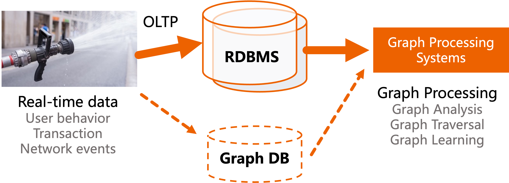

.. GART documentation master file, created by
   sphinx-quickstart on Tue Aug 27 10:19:05 2019.
   You can adapt this file completely to your liking, but it should at least
   contain the root `toctree` directive.

.. meta::
   :description: GART is a graph extension that includes an interface to an RDBMS and a dynamic graph store for online graph processing.
   :keywords: distributed-systems, distributed, graph-analytics, in-memory-storage, big-data-analytics, distributed-comp

GART: Graph Analysis on Relational Transactional Datasets

|Discussion| |License| |USENIX|

Why bother?
-----------------

A graph is a data representation that can express entities (e.g., users and goods) and connections (e.g., purchases).
Graph computation pairs for analyzing and querying on graph data have been widely used in a large number of business scenarios, such as product recommendation, fraud detection, supply chain analysis, and so on.

However, in practice, the data is often stored in relational database management systems (RDBMS), and the graph data is generated from the relational data.
The traditional way to analyze graph data is to extract the data from the relational database and migrate it to a graph database for graph computation.

There are two common architectures for graph data processing:

In order to do graph computation, relational database systems will provide some interface extensions, which is equivalent to a kind of syntactic sugar for graph processing, and the underlying still uses the relational model, e.g., `GraphScript`_ provided by SAP HANA, `SQL Graph`_ provided by SQL Server, `Apache AGE`_ as an extension for PostgreSQL.

On the other hand, there is also the option of exporting the data as offline graph data for offline graph data analysis and processing on a graph processing system (`Neo4j`_, `GraphScope`_, ...).

An ideal model for processing on-line graph data needs to fulfill at least the following three requirements:

1. **Performance**. The performance of the graph processing meets the performance of advanced graph processing systems. However, storing data as tables in relational storage for graph processing requires a large number of time-consuming join operations. Such operations cause serious performance degradation compared to the graph native storage and execution engine.

2. **Data freshness**. In order to keep the data current, long offline data moves need to be avoided so that analysis can be performed quickly on the updated data. In some time-sensitive scenarios, such as fraud detection, early analysis results can avoid losses.

3. **Expressiveness**. Graph data processing tasks are diverse, such as graph traversal, graph algorithms, graph learning, etc. Therefore, sufficient graph representation capabilities are needed to be able to represent different graph tasks efficiently.

What is GART?
-----------------

GART is a graph extension that includes an interface to an RDBMS and a dynamic graph store for online graph processing.
It is designed to bridge the gap between relational OLTP and graph-based OLAP.

We would like to be able to use graph flexibly without re-altering the existing relational database system. Moreover, users do not need to be aware of the storage of graph data and the synchronization of data between relational data and graph data for freshness. To fullfil this requirement, we build GART, an in-memory system for real-time online graph computation.

GART uses transational logs (e.g., binlog) to capture data changes, then recovers data changes into fresh graph data in real time. GART integrates graph computation engines (e.g. GraphScope, NetworkX) to support efficient graph computation processing. The workflow of GART is shown below.

.. figure:: images/arch.png
   :alt: GART architecture

GART captures the data changes in different (relational) data sources (e.g., database systems, streaming systems) and converts them to graph data according to user-defined rules.

Features
^^^^^^^^

Transparent Data Model Conversion
~~~~~~~~~~~~~~~~~~~~~~

To adapt to rich workload flexibility, GART proposes transparent data model conversion by graph extraction interfaces, which define rules of relational-graph mapping.
During the use of GART, data changes from relational databases are converted into graph data updates based on user-defined model mapping rules (RGMapping).  GART provides a set of interfaces for DBAs to define data model conversion rules, which can be compatible with SQL/PGQ DDL.

We provide a sample definition file called `RGMappings`_.

Efficient Dynamic Graph Storage
~~~~~~~~~~~~~~~~~~~~~~~~~~~~~~~

To ensure the performance of graph analytical processing (GAP), GART proposes an efficient dynamic graph storage with good locality that stems from key insights into online graph computation workloads, including:
1. an efficient and mutable compressed sparse row (CSR) representation to guarantee the locality of scanning edges;
2. a coarse-grained MVCC to reduce the temporal and spatial overhead of versioning;
3. a flexible property storage to efficiently run various GAP workloads.

Service-Oriented Deployment Model
~~~~~~~~~~~~~~~~~~~~~~

GART acts as a service to synchronize database changes to the graph store.
When pulled up as a service on its own, users can try out the full power of GART and different graph computation engines on the graph store.
At the same time, GART also provides a front-end, used as a database plug-in, currently supported as PostgreSQL extension.
Users can invoke GART's functions in the database client, such as RGMapping definitions, graph computation on the graph store, etc.

Get started now!
----------------

.. panels::
   :header: text-center
   :column: col-lg-12 p-2

   .. link-button:: notes/getting-started
      :type: ref
      :text: User Guides
      :classes: btn-block stretched-link
   ^^^^^^^^^^^^
   Get started with GART.

   ---

   .. link-button:: notes/cloud-native/deploy-kubernetes
      :type: ref
      :text: Deploy on Kubernetes
      :classes: btn-block stretched-link
   ^^^^^^^^^^^^
   Deploy GART on Kubernetes.

   ---

   .. link-button:: tutorials/tutorials
      :type: ref
      :text: Tutorials
      :classes: btn-block stretched-link
   ^^^^^^^^^^^^
   Explore use cases and tutorials where GART can bring added value.

   ---

   .. link-button:: notes/developers
      :type: ref
      :text: Getting Involved
      :classes: btn-block stretched-link
   ^^^^^^^^^^^^
   Get involved and become part of the GART community.

   ---

   .. link-button:: notes/developers/faq
      :type: ref
      :text: FAQ
      :classes: btn-block stretched-link
   ^^^^^^^^^^^^
   Frequently asked questions and discussions during the adoption of Vineyard.

Read the Paper
--------------

- Sijie Shen, Zihang Yao, Lin Shi, Lei Wang, Longbin Lai, Qian Tao, Li Su, Rong Chen, Wenyuan Yu, Haibo Chen, Binyu Zang, Jingren Zhou.
  `Bridging the Gap between Relational OLTP and Graph-based OLAP <https://www.usenix.org/system/files/atc23-shen.pdf>`_.
  USENIX Annual Technical Conference, Boston, MA, USA, July 2023. |USENIX|.

.. toctree::
   :maxdepth: 1
   :caption: User Guides
   :hidden:

   notes/getting-started.rst
   notes/architecture.rst
   notes/key-concepts.rst

.. toctree::
   :maxdepth: 1
   :caption: Cloud-Native
   :hidden:

   notes/cloud-native/deploy-kubernetes.rst
   notes/cloud-native/vineyard-operator.rst
   Command-line tool <notes/cloud-native/vineyardctl.md>

.. toctree::
   :maxdepth: 1
   :caption: Tutorials
   :hidden:

   tutorials/data-processing.rst
   tutorials/kubernetes.rst
   tutorials/extending.rst

.. toctree::
   :maxdepth: 1
   :caption: Developer Guides
   :hidden:

   notes/developers.rst
   notes/developers/faq.rst

.. _GraphScope: https://github.com/alibaba/GraphScope
.. _RGMappings: https://github.com/GraphScope/GART/blob/main/vegito/test/schema/rgmapping-ldbc.yaml
.. _GraphScript: https://help.sap.com/docs/hana-cloud-database/sap-hana-cloud-sap-hana-database-graph-reference/graphscript-language
.. _SQL Graph: https://learn.microsoft.com/en-us/sql/relational-databases/graphs/sql-graph-architecture?view=sql-server-ver16
.. _Apache AGE: https://age.apache.org/
.. _Neo4j: https://neo4j.com/

.. |Discussion| image:: https://img.shields.io/badge/Discuss-Ask%20Questions-blue?logo=GitHub
   :target: https://github.com/GraphScope/GART/issues

.. |License| image:: https://img.shields.io/github/license/graphscope/gart
   :target: https://github.com/GraphScope/GART/blob/main/LICENSE

.. |USENIX| image:: https://img.shields.io/badge/USENIX-blue
   :target: https://www.usenix.org/conference/atc23/presentation/shen
