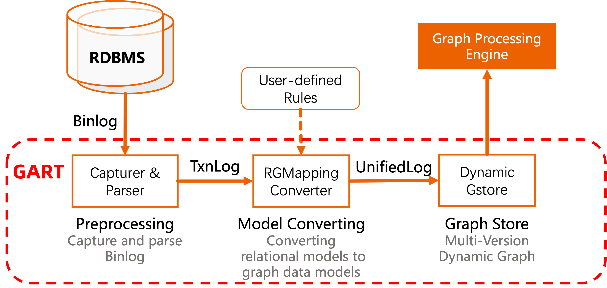

# Usage of GART Storage

GART Storage can be used with user-defined data sources.

The workflow of GART is the following steps:



Users can directly input the data as `TxnLog` to the converter and provide an `RGMapping` file.

## Building
```
git clone https://github.com/GraphScope/GART.git gart
cd gart

docker image rm gart; docker build -t gart .
docker run -it --name gart0 gart
```

## Input Data Format

Each data change record should be input to the converter in the format of TxnLog.

The sample format of `TxnLog` is as follows (Debezium style, only necessary information):
```
{
"before": null,
"after": {
    "org_id": "0",
    "org_type": "company",
    "org_name": "Kam_Air",
    "org_url": "http://dbpedia.org/resource/Kam_Air"
},
"source": {
    "ts_ms": 1689159703811,
    "db": "ldbc",
    "table": "organisation"
},
"op": "c"
}
```
This sample records the log that inserts a tuple of the `organisation` table.
For delete and update operations, the difference is about the `before`, `after`, and `op`.

For delete operations:
```
{
"before": {
    "org_id": "0",
    "org_type": "company",
    "org_name": "Kam_Air",
    "org_url": "http://dbpedia.org/resource/Kam_Air"
},
"after": null,
"source": {
    "ts_ms": 1689159703815,
    "db": "ldbc",
    "table": "organisation"
},
"op": "d"
}
```

For update operations:
```
{
"before": {
    "org_id": "0",
    "org_type": "company",
    "org_name": "Kam_Air",
    "org_url": "http://dbpedia.org/resource/Kam_Air"
},
"after": {
    "org_id": "0",
    "org_type": "company",
    "org_name": "Peter_Mark",
    "org_url": "http://dbpedia.org/resource/Peter_Mark"
},
"source": {
    "ts_ms": 1689159703815,
    "db": "ldbc",
    "table": "organisation"
},
"op": "u"
}
```

## RGMapping Format
The sample RGMapping format is in the file [rgmapping-ldbc.yaml](../vegito/test/schema/rgmapping-ldbc.yaml).

The vertex type is defined under `vertexMappings.vertex_types` as follows, which dedicates the table name (`dataSourceName`) and the mapping between relational attributes and vertex properties.
```
- type_name: organisation
    dataSourceName: organisation
    idFieldName: org_id
    mappings:
    - property: org_id
        dataField:
        name: org_id
    - property: org_type
        dataField:
        name: org_type
    - property: org_name
        dataField:
        name: org_name
    - property: org_url
        dataField:
        name: org_url
```

The edge type is defined under `edgeMappings.edge_types` as follows, which dedicates the source and destination vertex types (`source_vertex`, `destination_vertex`), the relational table name (`dataSourceName`), the keys to connecting two vertices, and the mapping between relational attributes and edge properties.
```
- type_pair:
    edge: org_islocationin
    source_vertex: organisation
    destination_vertex: place
    dataSourceName: org_islocationin
    sourceVertexMappings:
    - dataField:
        name: src
    destinationVertexMappings:
    - dataField:
        name: dst
    dataFieldMappings:
    []
```
